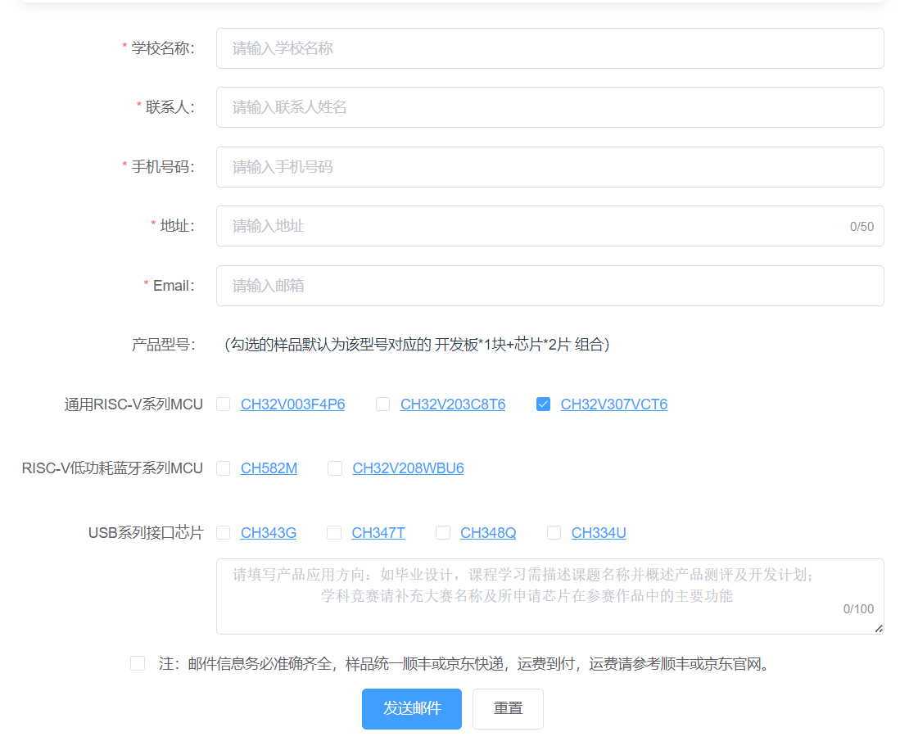
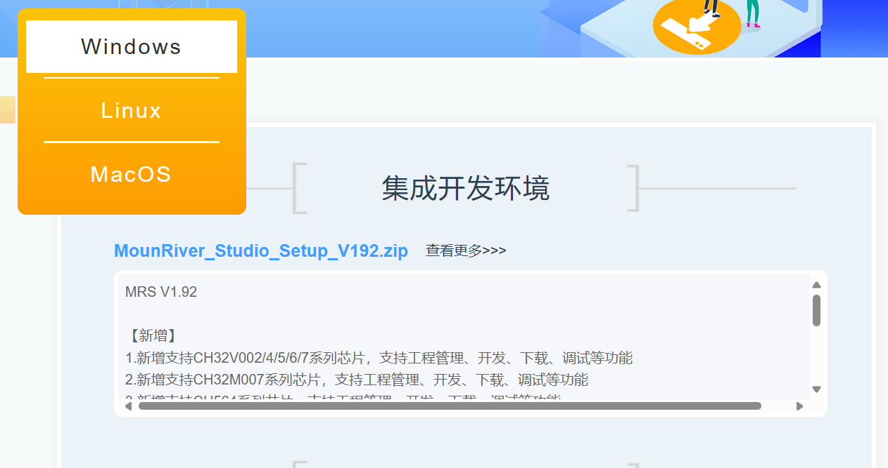
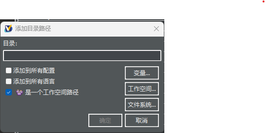
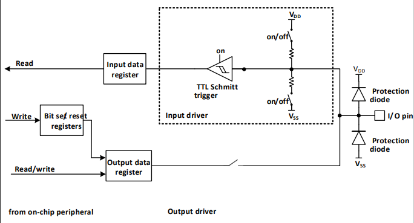

# CH32V307学习笔记

***

## 说明：
1. 本文档由白令鹤鸣撰写，由白令鹤鸣负责解释。
2. 本文档用于记录白令鹤鸣学习CH32V307过程中的笔记。
3. 文档进行小修改则仅更改小数点后数字，如**V1.2->V1.3**；
   进行大模块的补充则更改小数点前数字，如**V1.7->V2.0**。

| 文档名称 | 版本 | 作者 | 时间 | 备注 |
| :------: | :---: | :---: | :---: | :---: |
|CH32V307学习笔记|V1.0|白令鹤鸣|2024.9.23|初次建立|
|CH32V307学习笔记|V1.1|白令鹤鸣|2024.9.26|增加了GPIO部分介绍|

***
## 一、开发板
### 1.开发板介绍
   本教程使用沁恒微电子官方设计的CH32V307VCT6评估板，如图：  
  
   根据官方文档:
   |模块说明\Descriptions ||||
   |-----|-----|-----|-----|
   |1、网口|5、ARDUINO 接口|9、WCH_LinkE IAP 按键|13、USER 按键|
   |2、USB 高速接口|6、复位按键 |10、WCH_LinkE 接口 |14、LED |
   |3 、MCU I/O |7、WCH-LinkE 指示灯|11、SDI&UART 接口 |15、稳压芯片|
   |4、主控 MCU |8、电源开关 |12、WCH-LinkE MCU |16、USB 全速接口|
### 2.开发板获取
1. 淘宝购买：在淘宝**WCH沁恒微电子官方店**购买。
>   店铺链接:***https://m.tb.cn/h.grs5NQzlw9VA6o1***
>   商品链接：***http://e.tb.cn/h.grsTYozaageT696?tk=QTb13R4TXUA***
2. 样品索取：在沁恒微电子官网进行样品索取，点击沁恒微电子官网上方栏**服务支持->样品索取**即可进入。进入后界面如图所示，如实填写相关信息即可。  

>  沁恒微电子官网：***https://www.wch.cn***

***
## 二、编译环境
### 1.安装MouRiver Studio(MRS)
#### 1.1 MRS下载
MRS提供Windows、Linux两个版本。
本教程主要运行环境为Windows，通过点击MounRIver_Studio_Setup_Vxxx.zip下载最新版本，也可点击查看更多下载历史版本。  

>    官网下载地址：***http://www.mounriver.com/download***
 
#### 1.2 MRS安装
1.  解压安装包，双击MounRiver_studio_Setup_Vxxx.exe执行安装，出现如下界面，按照提示，点击**下一步**。  

2.  点击**我接受**，同意安装许可协议。  

3.  选择安装路径，注意路径中不要有空格和中文等特殊字符，选择好路径后，点击**下一步**。  

4.  选择**开始菜单**文件夹，默认即可，点击**安装**。  
   

5.  执行安装，过程有点漫长，耐心等待即可。  

6.  完成MRS安装。点击完成即可。  

7. 安装完成后，桌面会出现MRS的快捷方式。如下图所示：  

### 2.基础使用说明
#### 2.1 汉化：
   MounRiver Studio提供了官方汉化。
   MSR汉化的打开方式：**MRS菜单栏 Help->Language->简体中文**。  
  
   完成后重启编译器即可使用官方汉化包。

#### 2.2 帮助文档：
   MRS帮助文档的打开方式：**MRS菜单栏 帮助->帮助手册**。  
  

#### 2.3 创建一个空工程：
   1.  点击主菜单 **文件->新建->MounRiver工程**，出现如图所示的界面：  

   2. 工程名为所建工程的名称，
      使用解决方案位置为默认存放路径，取消该项勾选为使用自定义路径，自定义路径在工程路径一栏选择。
      左侧框选择芯片厂商和系列，或者选择通用类型，右侧选择具体的芯片型号。可通过RISC-V Core与ARM Core勾选项以及Type Search快速过滤内置芯片模板。也可勾选Self-define template，创建自定义工程。
   3. 点击Finish完成创建工程。

#### 2.4 路径添加：
   1. 右键单击目标工程，选择**属性**
      出现如图所示的界面：  

   2. 在左侧栏中选择**C/C++ General->路径和符号**打开。
   3. 点击右侧栏中的**添加...**
      出现如图所示的界面：  

   4. 勾选**是一个工作空间路径**，并写入对应文件的文件夹路径。(推荐使用相对路径 **/${ProjName}/...**，而不是绝对路径，方便后续工程迁移)。
   5. 点击**应用并关闭**，完成路径的添加。

#### 2.5 导入一个已有工程
   1.  点击主菜单 **文件->加载**
      出现如图所示的界面：  

   2. 点击**浏览...**，选择对应工程。
   3. 点击**确定**，即可导入选中的目标工程。

## 三、基础外设学习
### 1.GPIO
#### 1.1 GPIO基础介绍
1. GPIO的模式
   端口的每个引脚都可以配置成以下的多种模式之一：
   1. 浮空输入
   2. 模拟输入
   3. 开漏输出   
   4. 推挽输出
   5. 上拉输入
   6. 下拉输入
   7. 复用功能的输入和输出  
   
> 注：许多引脚拥有复用功能，外设将自己的输出和输入通道映射在这些引脚上，这些复用引脚的具体用法需要参照各个外设，本小节不做解释。

2. GPIO模块的基本结构框图
   GPIO模块的基本结构如下图所示：  
  
   每个引脚在芯片内部都有两只保护二极管，分别接到正负电源处，防止过高的电压直接接入GPIO模块导致芯片烧毁。
   IO口内部可分为输入和输出驱动模块。
   其中输入驱动有弱上下拉电阻可选，可连接到AD等模拟输入的外设；如果输入到数字外设，就需要经过一个TTL施密特触发器，再连接到GPIO输入寄存器或其他复用外设。

   输出驱动部分有一对MOS管，可通过配置上部的P-MOS管是否使能来将IO口配置成开漏或推挽输出；输出驱动内部也可以配置成由GPIO控制输出还是由复用的其他外设控制输出。

>  **施密特触发器**：简单来说，就是当输入电压高于正向阈值电压，输出为高；当输入电压低于负向阈值电压，输出为低；当输入在正负向阈值电压之间，输出不改变。因此只有当输入电压发生足够的变化时，输出才会变化。  
>   

>  **推挽输出**:推挽输出是由两个三极管或者MOS管受到互补信号控制，两个管子始终保持一个处于截止，另一个处于导通的状态。电路工作时，两只对称的开关管每次只有一个导通。最大特点是可以真正能真正的输出高电平和低电平，在两种电平下都具有驱动能力。

>  **开漏输出**:对于开漏输出和推挽输出的区别最普遍的说法就是开漏输出无法真正输出高电平，即P-MOS被失能，对高电平时没有驱动能力，需要借助外部上拉电阻完成对外驱动。

3. GPIO 的初始化功能 
刚复位后，GPIO 口运行在初始状态，这时大多数 IO 口都是运行在浮空输入状态，但也有 HSE 等外设相关的引脚是运行在外设复用的功能上。具体的初始化功能请参照引脚描述相关的章节。

#### 1.2 GPIO模式的具体介绍
1. 输入模式 
当IO口被配置成输入模式时如图所示：  
   
输出驱动断开，输入有上拉、下拉和浮空（即不配置上下拉电阻）可选，~~断开复用功能和模拟输入~~（？存疑，待实际测试）。
在每个 IO 口上的数据在每个PB2时钟被采样到输入数据寄存器，读取输入数据寄存器对应位即可获取对应引脚的电平状态。
2. 输出模式
当IO口被配置成输出模式时如图所示： 
   
输出驱动器中的一对MOS被配置成推挽或开漏模式，不使用复用功能。
输入驱动的上下拉电阻被禁用，TTL施密特触发器被激活，出现在IO引脚上的电平将会在每个PB2时钟被采样到输入数据寄存器，所以读取输入数据寄存器将会得到当前IO状态。
在推挽输出模式时，由于输入输出端口被MOS管所控制，故对输出数据寄存器的访问就会得到最后一次写入输出寄存器的值。
3. 复用模式
当IO口被配置成复用模式时如图所示： 
   
输出驱动器被使能，可以按需要被配置成复用开漏或复用推挽模式，施密特触发器被打开，复用功能的输入和输出线都被连接，输出数据寄存器被断开，出现在IO引脚上的电平将会在每个PB2时钟被采样到输入数据寄存器。
在复用开漏模式下，读取输入数据寄存器将会得到IO口的当前状态；在推挽模式下，读取输出数据寄存器将会得到最后一次片上外设写入的值。
4. 模拟输入
当IO口被配置成复用模式时如图所示： 
   
在启用模拟输入时，输出驱动被断开，输入驱动中施密特触发器的输入被失能以防止产生IO口上电流的消耗，上下拉电阻被禁止，读取输入数据寄存器返回值将一直为0。

#### 1.3 常用外设复用功能引脚推荐的GPIO模式
**高级定时器（TIM1/8/9/10）：**
|TIM1/8/9/10 引脚|配置|GPIO 配置|
|:---:|:---:|:---:|
|TIM1/8/9/10_CHx|输入捕获通道 x|浮空输入|
|TIM1/8/9/10_CHx|输出比较通道 x|推挽复用输出|
|TIM1/8/9/10_CHxN|互补输出通道 x|推挽复用输出|
|TIM1/8/9/10_BKIN|刹车输入|浮空输入|
|TIM1/8/9/10_ETR|外部触发时钟输入|浮空输入|  

**通用定时器（TIM2/3/4/5）：**
|TIM2/3/4/5 引脚|配置|GPIO 配置|
|:---:|:---:|:---:|
|TIM2/3/4/5_CHx|输入捕获通道 x|浮空输入|
|TIM2/3/4/5_CHx|输出比较通道 x|推挽复用输出|
|TIM2/3/4/5_ETR|外部触发时钟输入|浮空输入|  

**通用异步串行收发器（UART）：**
|USART 引脚|配置|GPIO 配置|
|:---:|:---:|:---:|
|UARTx_TX|全双工模式|推挽复用输出|
|UARTx_TX|半双工同步模式|开漏复用输出|
|UARTx_RX|全双工模式|浮空输入或带上拉|
|UARTx_RX|半双工同步模式|未使用|  

**内部集成总线（I2C）模块：**
|I2C 引脚|配置|GPIO 配置|
|:---:|:---:|:---:|
|I2C_SCL|I2C 时钟|开漏复用输出|
|I2C_SDA|I2C 数据|开漏复用输出|

**串行外设接口（SPI）模块：**
|SPI 引脚|配置|GPIO 配置|
|:---:|:---:|:---:|
|SPIx_SCK|主模式|推挽复用输出|
|SPIx_SCK|从模式|浮空输入|
|SPIx_MOSI|全双工主模式|推挽复用输|
|SPIx_MOSI|全双工从模式|浮空输入或带上拉输入|
|SPIx_MOSI|简单的双向数据线/主模式|推挽复用输出|
|SPIx_MOSI|简单的双向数据线/从模式|未使用|
|SPIx_MISO|全双工主模式|浮空输入或带上拉输入|
|SPIx_MISO|全双工从模式|推挽复用输出|
|SPIx_MISO|简单的双向数据线/主模式|未使用|
|SPIx_MISO|简单的双向数据线/从模式|推挽复用输出|
|SPIx_NSS|硬件主或从模式|浮空、上拉或下拉输入|
|SPIx_NSS|硬件主模式/NSS 输出使能|推挽复用输出|
|SPIx_NSS|软件模式|未使用|

**控制器局域网（CAN）模块：**
|CAN 引脚|GPIO 配置|
|:---:|:---:|
|CANx_TX|推挽复用输出|
|CANx_RX|浮空输入或上拉输入|  

**模拟转数字转换器（ADC）及数字转模拟转换器（DAC）：**
|ADC/DAC 引脚|GPIO 配置|
|:---:|:---:|
|ADC/DAC|模拟输入|

#### 1.4 GPIO例程
##### 1.4.1 点亮LED
>例程参考：
>例程链接：
##### 1.4.2 单按键读取
>例程参考：
>例程链接：
##### 1.4.3 按键长短按读取
>例程参考：
>例程链接：
##### 1.4.4 非阻塞式按键长短按读取（定时器）
>例程参考：
>例程链接：